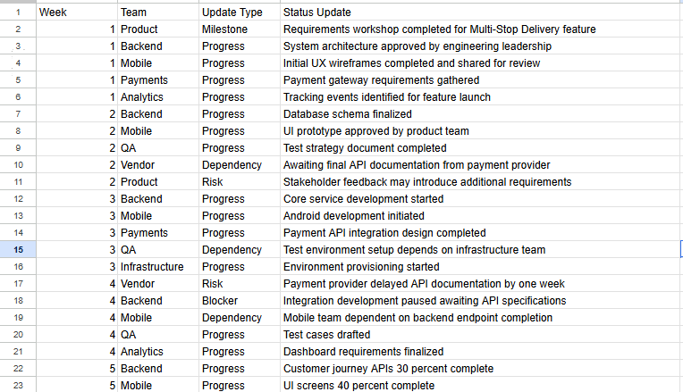
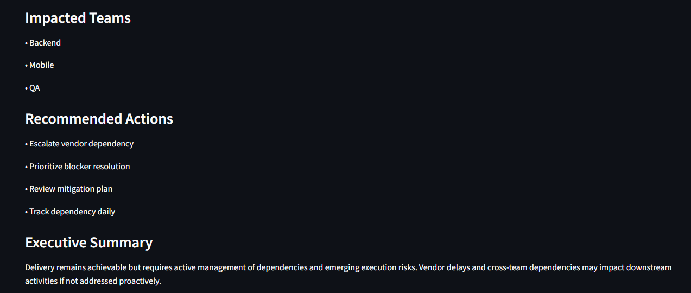

# Careem Delivery Intelligence Copilot

## Overview

Careem Delivery Intelligence Copilot is a prototype designed to help delivery managers, TPMs, product teams, and engineering leaders proactively identify project risks before they impact launch timelines.

The solution analyzes project status updates and automatically generates:

* Project Health
* Delivery Confidence
* Key Risks
* Dependencies
* Impacted Teams
* Forecast Delays
* Recommended Actions
* Executive Summaries

## Problem

Project updates are often reviewed manually, making it difficult to identify emerging risks, blockers, and dependencies across teams.

## Solution

The prototype converts project updates into actionable delivery intelligence, helping teams proactively manage execution risks and delivery timelines.

## Technology Stack

* Python
* Streamlit
* Rule-Based Delivery Intelligence Engine

## Future Enhancements

* LLM-powered recommendations
* Dependency chain analysis
* Scenario simulation
* Predictive delivery forecasting
* ## Screenshots

### Dashboard Overview

### Full Analysis

### Executive Summary

